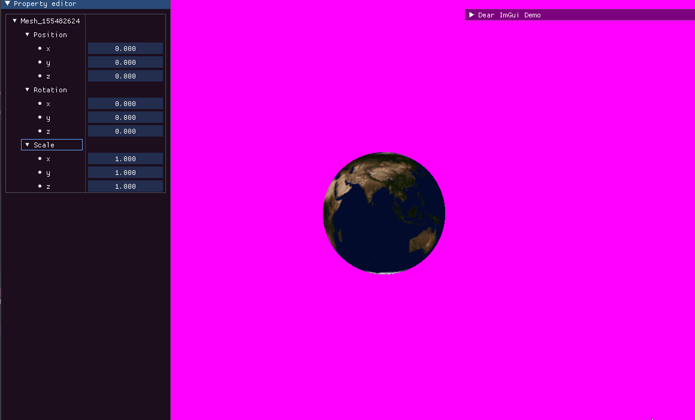

# OpenGLearningProject

I made this project to learn a bit about game engines and how they work. For the moment it's just a Graphics Engine with the primary blocks ready to potentially scale it in the future.

Since it's a learning project to understand how the underlying system of graphics engine works, I didn't bother to make it as a library and it builds as an executable file. Also, I only tested it as a x86 (Win32) application and it will not work as an x64 executable.

For the libraries, I used ImGUI as a debugging in-app interface, GLFW for creating the OpenGL context and reading inputs from the hardware, stb_image for image processing, glm for the maths and spdlog for logging purposes.

This project is very much a WIP!

## What is already in the project?

For the moment we have:

-   Our own Event System that provides an abstraction from GLFW
-   A little logger
-   All the primary main thread logic to launch and run the app
-   ImGUI that will be used as a user interface to do... things?
-   All the abstraction for the VAOs, VBOs, shaders etc... for OpenGL
-   A Multi-Layered system
-   A render-thread working (although I'm not satisfied with the logic since I'm using a deque as command queue and I really want to store the commands in a memory arena but I don't really know how... yet 🤔)
-   A Mesh class (still needs a lot of work)
-   Procedurally generated UV sphere method (because... why not)
-   A camera with orbital control.

### Preview

The weird artifacts are from my gif recording video... I don't know why it's like this.

## Future of this project

My goal for this project is to at least achieve PBR for the graphics engine but first I'll probably implement FBOs and Phong lighting.
